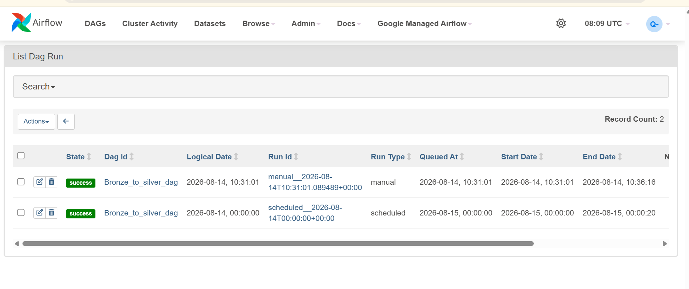
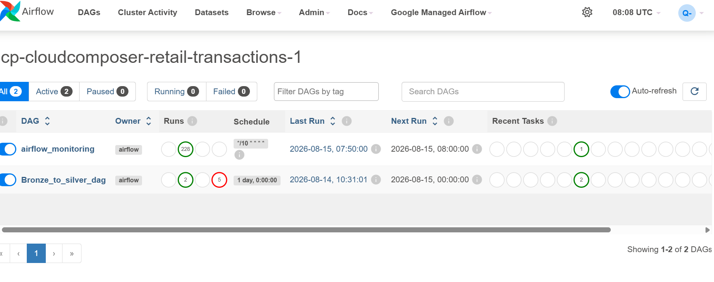
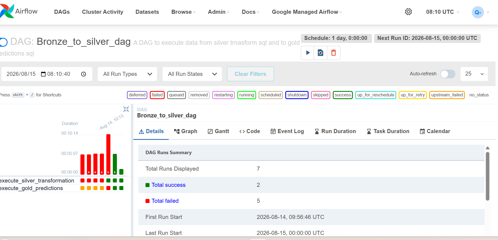

# Cronicle – Pipeline Scheduling

## Overview

Cronicle is used to schedule and monitor the Python ingestion process running on the GCP VM.

For this project, the ingestion script is scheduled to run at **06:00 SAST**. Once the raw data has been ingested into the Bronze layer, the downstream Silver and Gold transformations are handled through BigQuery Scheduled Queries.

## Why Cronicle?

I used Cronicle as a lightweight scheduling option for the ingestion process. It provides visibility into scheduled jobs, execution history and job status, while keeping the infrastructure relatively simple and cost-effective.

It also provides options for notifications and alerts, which would be useful in a production environment for monitoring failed ingestion jobs.

