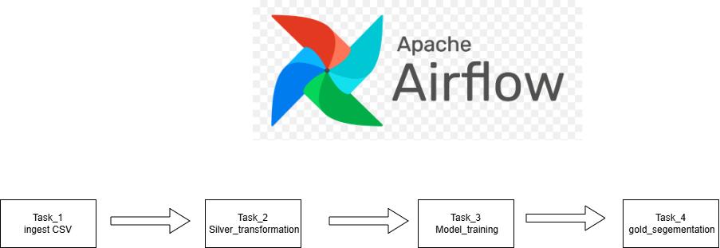

## Design Trade-offs

I considered two orchestration approaches for this project.

### Option 1: VM + Python + Cronicle + Scheduled Queries

The Python ingestion script runs on the VM and is scheduled using Cronicle at **06:00 SAST**. BigQuery Scheduled Queries then handle the Silver and Gold transformations at **07:00 and 07:30 SAST**.

**Pros:**
- Simple and cost-effective
- Cronicle provides job visibility and alerting
- Easy to maintain for a small pipeline

**Cons:**
- Tasks are not fully dependent on each other
- A downstream query could run even if ingestion fails

### Option 2: Airflow / Cloud Composer

Airflow can manage the entire pipeline with dependencies between ingestion, Silver and Gold tasks.

**Pros:**
- Task dependencies and retries
- Backfilling
- Centralised logs and monitoring
- Visual pipeline execution

**Cons:**
- Higher cost
- More infrastructure and operational complexity
- Requires careful DAG design as the number of pipelines grows

### Overall Approach

For this project, I implemented the lightweight **VM + Python + Cronicle + Scheduled Queries** approach while also demonstrating an **Airflow** implementation.

The VM approach is suitable for a simple pipeline, while Airflow becomes more valuable as the pipeline grows and requires stronger dependencies, retries, monitoring and backfilling.
