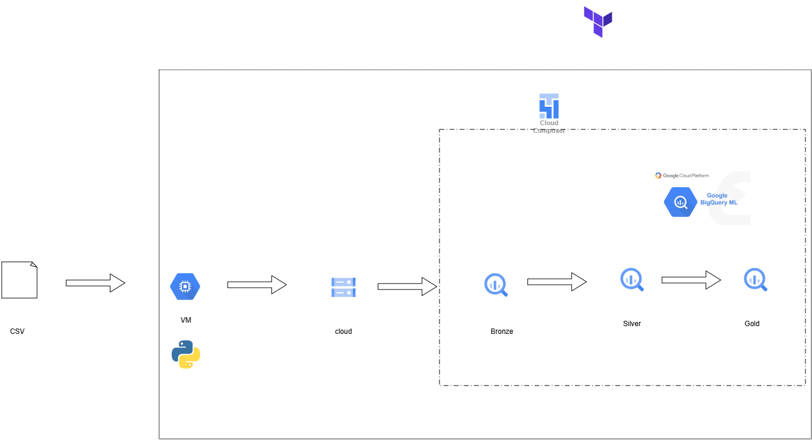
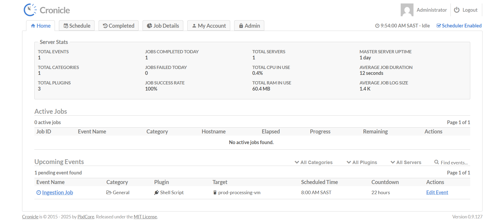

# Incubeta Data Engineering Screening Challenge
## BQML & Medallion Data Pipeline

## Introduction

I would like to thank the Incubeta team for giving me the opportunity to complete this screening challenge. I really appreciate the chance to work through the case study and showcase my data engineering skills, technical approach and the way I think about building data solutions.

I have also taken the opportunity to go beyond the minimum requirements of the challenge and demonstrate how I would approach extending the solution towards a more production-oriented data pipeline.

## Repository Structure

The numbered folders are intentional. I used them to make the repository easy to navigate and to reflect the way the project is presented.

The numbering keeps the most important parts of the screening challenge at the top, while also clearly separating the additional engineering work I added.

- **01_sql** – Core SQL implementation required by the challenge
- **02_proof** – Proof of execution and BQML evaluation
- **03_doc** – The challenge orchestration documentation
- **04_ingestion** – Additional Python ingestion implementation
- **05_Helper** – Reusable Python helper modules
- **06_orchestration** – Cronicle and Airflow orchestration
- **07_infrastructure** – Terraform infrastructure
- **08_ETA_ipynb** – Exploratory data analysis

---


### Project Overview

This project implements the Incubeta Data Engineering Screening Challenge using **Google BigQuery, BigQuery ML and a Medallion Architecture**.

The main objective was to take the provided raw retail transaction data, clean and transform it through the **Bronze → Silver → Gold** layers, and use **BigQuery ML K-means clustering** to create customer segments.

---

## Challenge Requirements

I completed the core requirements of the challenge entirely using GCP and BigQuery:

- **Bronze:** Ingested the raw transaction data into `retail_bronze.raw_transactions`.
- **Silver:** Cleaned and transformed the data into `retail_silver.cleaned_transactions`, including data type conversion, missing value handling, anomaly filtering and feature engineering.
- **Gold:** Created a BQML K-means clustering model and used the predictions to produce `retail_gold.analytics_customer_segments`.
- **Proof of Execution:** Screenshots and BQML evaluation results are available in the [`02_proof`](./02_proof) folder.

The SQL implementation required for the challenge is available in [`01_sql`](./01_sql).

---

## Additional Engineering Scope

The challenge could be completed directly within BigQuery. I chose to extend the solution to demonstrate how I would approach the pipeline in a more production-oriented environment.

This additional scope includes:

- **Python ingestion** running on a GCP VM
- **Reusable helper modules** for BigQuery and Cloud Storage
- **Cloud Storage** for raw/Parquet data
- **Terraform** for infrastructure provisioning
- **Cronicle** for scheduling the ingestion process
- **Airflow / Cloud Composer** for dependency-based orchestration

I see this as an extension of the screening solution rather than part of the minimum challenge requirements.

The distinction is intentional: **BigQuery represents the core solution requested by Incubeta, while the additional components demonstrate how I would think about operationalising and scaling the pipeline.**

---

## Diagram 



## Production Orchestration

For a simple production setup, I would run the Python ingestion script on the VM using **Cronicle**, scheduled for 06:00 SAST, followed by BigQuery Scheduled Queries for the Silver transformation at 07:00 and Gold transformation at 07:30.

This approach is lightweight and cost-effective, but the jobs are not task-dependent. For a more mature production environment, I would use **Cloud Composer/Airflow** to orchestrate the pipeline, allowing task dependencies, retries, backfilling, monitoring and centralised logging.

#Query Optimisation

As the pipeline moves from a one time process to a scheduled production workload, I would also optimise the SQL to take advantage of **partitioned tables**. Rather than scanning the entire base table on every run, I would define a lookback window based on the expected range of **late arriving data**. The base table only looks at the last 30 days This would reduce unnecessary data scanned, query costs and runtime while still accounting for late-arriving records.

The orchestration implementation is available in [`06_orchestration`](./06_orchestration).

### Cronicle Access

The Cronicle scheduling environment used for the ingestion process is also available for review via HTTPS. The access link is provided through the GitHub repository so the Incubeta team can view the scheduled ingestion jobs and their execution history.

#Cronicle live here
**[Access Cronicle via HTTPS](http://34.148.179.127/#Schedule)**

**The password and username is admin **




---

## Project Documentation

I have also included two supporting project write-ups that go deeper into the implementation and the business use case.

### How I Completed This Project

This document explains my implementation from the initial GCP setup and Terraform infrastructure through to ingestion, transformation, BQML, orchestration and the design decisions I made along the way.

**[Read: How I Completed This Project](https://docs.google.com/document/d/1gtlpnJ4GLTuG6rczlIHW7tyP2N1-aZkAu7gNBhtf8ps/edit?tab=t.0)**

### Case Study: Implementing the Customer Segmentation Model

This document takes the segmentation model beyond the technical implementation and looks at how the customer segments could be used for **lifecycle messaging and targeted marketing**.

It explores how customer behaviour and product preferences could be used to target customers with more relevant content, measure campaign engagement and ultimately connect the data engineering pipeline back to marketing outcomes.

**[Read: Implementing the Case Study on the Segmentation Model](https://docs.google.com/document/d/1cVFRCrv1KT7dgPdbXkf9MIxN9cxGobw3gFLrP2OIJsk/edit?tab=t.0)**

---

## Structure

```text
GCP_DATA_INFRASTRUCTURE/
│
├── README.md
├── .gitignore
├── ETL_daigram.png
├── Overview_cronicle_1.png
│
├── 01_sql/
│   ├── gold_model_training.sql
│   ├── gold_prediction.sql
│   └── silver_transform.sql
│
├── 02_proof/
│   ├── amount.png
│   ├── gold_table.png
│   └── segmentation_diagram.png
│
├── 03_doc/
│   └── orchestration_discussion.readme
│
├── 04_ingestion/
│   └── retail_data_ingestion.py
│
├── 05_Helper/
│   ├── bigquery.py
│   └── logger.py
│
├── 06_orchestration/
│   ├── readme.md
│   │
│   ├── airflow/
│   │   ├── Bronze_to_silver_dag.py
│   │   ├── Dag_run.png
│   │   ├── image.png
│   │   ├── Overview.png
│   │   └── readme.md
│   │
│   └── cronicle/
│       ├── job_history.png
│       ├── Overview_cronicle.png
│       ├── read.me
│       ├── README.md
│       └── scheduled_events.png
│
├── 07_infrastructure/
│   ├── environment/
│   │   ├── main.tf
│   │   └── variables.tf
│   │
│   └── modules/
│       ├── bigquery/
│       ├── compute/
│       └── storage/
│
└── 08_ETA_ipynb/
    └── explore_data_analysis.ipynb
```

---

## AI Usage

AI tools were used as an engineering assistant during the project to help with research, troubleshooting, architecture discussions and documentation as as well as troubleshooting Ttools like VM permissions, Cloud Composer, Terraform, SSH and Python errors.

I remained responsible for the implementation, testing and validation of the solution and used AI as a supporting tool rather than relying on it to complete the project independently.

---

## Technologies

**Google Cloud:** BigQuery, BigQuery ML, Compute Engine, Cloud Storage, Cloud Composer

**Development:** Python, SQL, Terraform

**Orchestration:** Cronicle, Airflow

**Daigrams:** draw.io 

---
## Next Steps

If I had more time, I would have liked to take this project further by showing how the SQL and Python scripts could be version controlled through a CI/CD process.

For example, changes to Scheduled Queries could require a Pull Request before being promoted to production. A Bash validation script could also compare the Scheduled Queries stored in the Git production repository against the versions currently running in BigQuery. If a difference is detected, it could raise a flag so that Git remains the source of truth and the production repository stays up to date.

The same approach could be applied to the Python ingestion scripts, providing better version control, change tracking and governance as the pipeline moves towards production.


Owner: Kamogelo Mogoba 
